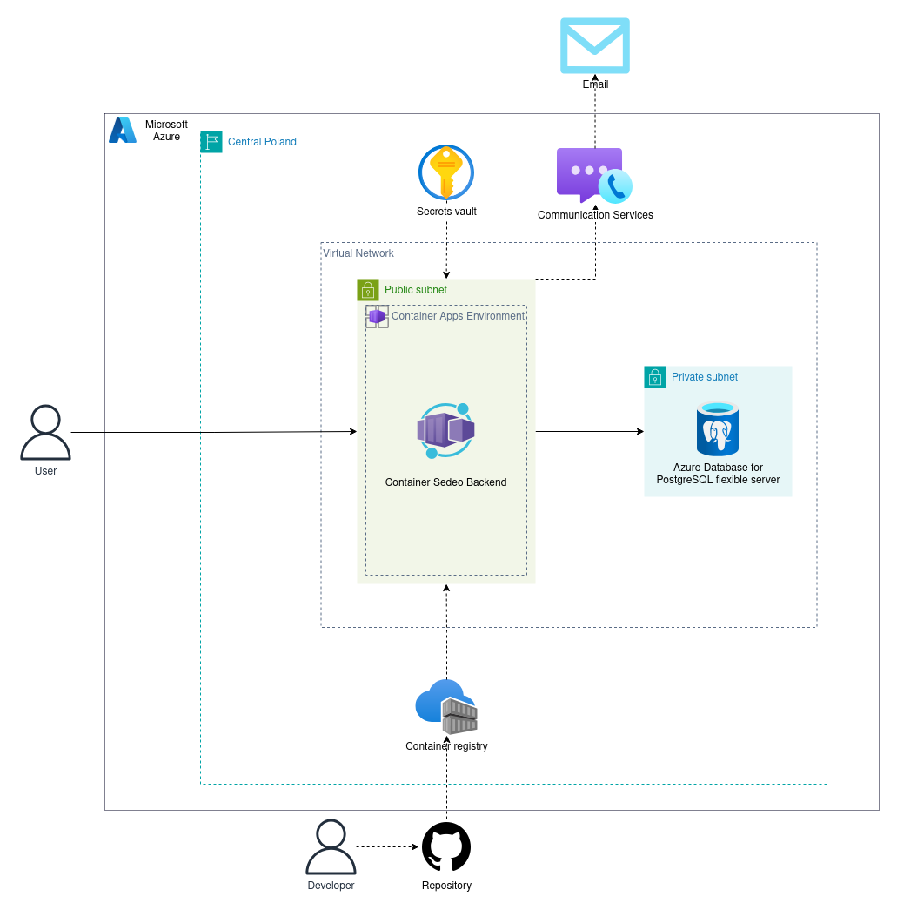

# Sedeo Azure infrastructure

This document describes the organization of a Sedeo Azure infrastructure. The server is currently accessible at the
provided address: https://backend-sedeo.graybush-29f48765.polandcentral.azurecontainerapps.io

## Overview

The infrastructure is deployed in Poland Central region. The
architecture consists of a Spring Boot application running in Azure Container Apps, a PostgreSQL flexible server for
database storage, Azure Key Vault for secrets management, Azure Container Registry (ACR) for container images, and Azure
Communication Services for emailing functionality.

## Virtual Network

A single **Virtual Network (VNet)** is created to host both the application and the database. Within this VNet, there
are two subnets: a **public subnet** where the application container resides and a **private subnet** that hosts the
PostgreSQL Flexible Server. The application is deployed within Azure Container Apps Environment and retrieves its container image
from Azure Container Registry. The images are built and pushed to ACR from a GitHub repository using an automated CI/CD
pipeline. The Spring Boot application accesses sensitive data, such as database credentials and API keys, from Azure Key
Vault to maintain security best practices. Due to security reasons and best practices secrets are not included in
Terraform files and should be created manually.

## Database Deployment

The PostgreSQL database is deployed in **Flexible Server** mode and is placed in the private subnet to ensure it remains
isolated from external access. A private endpoint is configured to allow secure communication between the application and the database
without exposing it to the public internet. The application connects to the database exclusively through this private
endpoint, reinforcing security measures.

## Secret Management

To manage sensitive information securely, **Azure Key Vault** is used to store credentials, API keys, and other
configuration secrets. The Spring Boot application accesses these secrets using Managed Identity, eliminating the need
to store them in the container environment.

## Azure Communication Services

The infrastructure also integrates **Azure Communication Services** to facilitate email functionality. Outgoing emails are
sent using Azure's SMTP or REST APIs, allowing the application to communicate effectively with users.

## CI/CD Workflow

The CI/CD workflow automates the deployment process. When developers push code changes to GitHub, GitHub Actions trigger
a build process, creating a Docker image of the application. Developer then trigger a workflow that will push the image
to **Azure Container Registry**, from which **Azure Container Apps** pulls the latest image for deployment. This automation
ensures that the application remains up to date with minimal manual intervention.